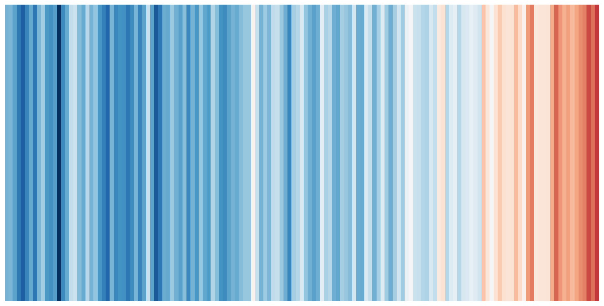
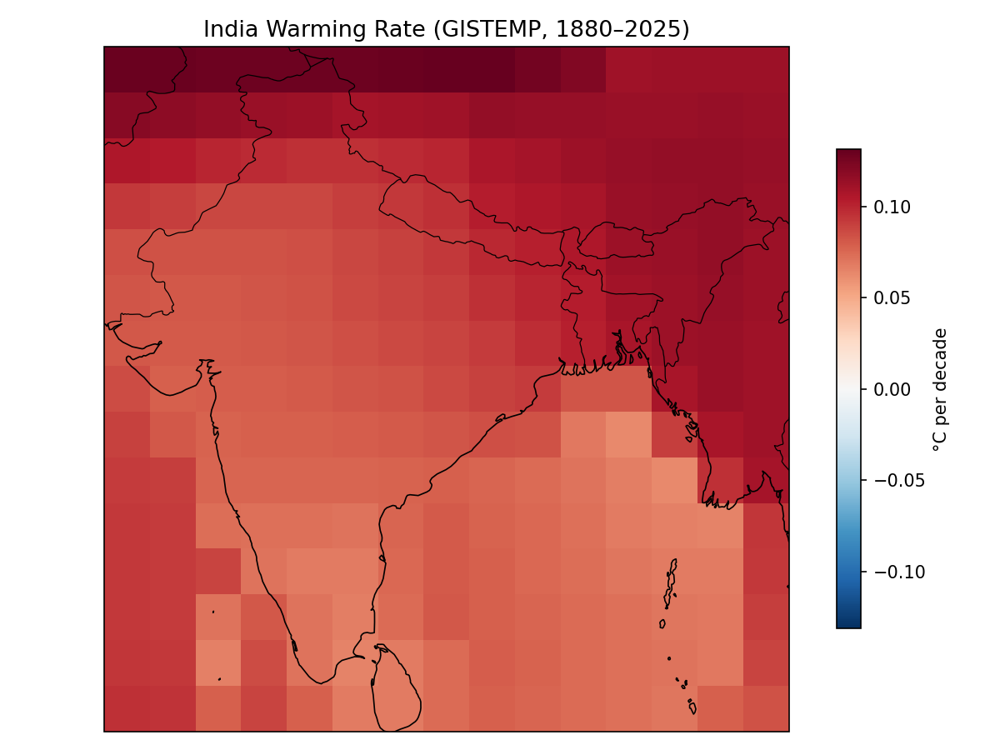

# India Climate Analysis
Reproduces two canonical climate visualisations for India using the NASA GISTEMP v4 gridded dataset: Ed Hawkins-style warming stripes and a per-grid warming-rate map. Built on the Pangeo stack (xarray · cartopy).

[](https://www.python.org/)
[](https://xarray.dev/)
[](LICENSE)

A climate-data pipeline that computes India's annual temperature
anomaly from a gridded dataset, visualizes it as **warming stripes**,
and maps the **per-grid-cell warming rate** (°C/decade).

---

## Outputs

| Warming Stripes | Warming-Rate Map |
| :---: | :---: |
|  |  |
| Annual anomaly, 1880–present | Linear trend per grid cell (°C/decade) |

---

## Data

| Field | Value |
| --- | --- |
| **Dataset** | NASA GISTEMP v4 — gridded Land+Ocean (`gistemp1200_GHCNv4_ERSSTv5`) |
| **Resolution** | 2° × 2°, monthly |
| **Coverage** | 1880 – present |
| **Variable** | `tempanomaly` (temperature anomaly, °C) |
| **Baseline** | 1951–1980 (re-referenced to 1981–2010 in analysis) |
| **Source** | [data.giss.nasa.gov/gistemp](https://data.giss.nasa.gov/gistemp/) |
| **License** | Public domain (U.S. Government work) |

> **Provenance note:** GISTEMP ships no separate climatology field, so anomalies
> are re-baselined directly rather than reconstructed from absolute temperatures.

The pipeline falls back cleanly to **HadCRUT5** or **Berkeley Earth** gridded
NetCDF (identical workflow; only variable/coordinate names change).

---

## Methods

1. **Open & inspect** the NetCDF with xarray (CF-compliant datetime axis).
2. **Subset** to India (`lat 6–38`, `lon 68–98`) and resample monthly → annual.
3. **Area-weight** the spatial mean with cos(lat) weights to get a 1-D annual series.
4. **Render** warming stripes (RdBu_r colormap, centered on zero, no axes).
5. **Re-baseline** anomalies to a 1981–2010 reference period.
6. **Fit** a per-grid-cell linear trend (`polyfit`), converted to °C/decade.
7. **Map** the trend field with cartopy (PlateCarree, coastlines, borders, colorbar).

---

## Setup

Runs end-to-end in **Google Colab** (no local install) on Python 3.12.

```bash
pip install xarray netcdf4 matplotlib cartopy numpy pandas dask xclim
```

The notebook mounts Google Drive and downloads the dataset once (~23 MB gzipped),
caching it to Drive so it is not re-fetched on session reset:

```python
from google.colab import drive
drive.mount('/content/drive')
```

```bash
wget -O gistemp1200_GHCNv4_ERSSTv5.nc.gz \
  https://data.giss.nasa.gov/pub/gistemp/gistemp1200_GHCNv4_ERSSTv5.nc.gz
gunzip -f gistemp1200_GHCNv4_ERSSTv5.nc.gz
```

---
## Usage

Open the notebook and run all cells top to bottom:

```bash
jupyter notebook Warming_Analysis_India.ipynb
```
---

## References

- [Show Your Stripes](https://showyourstripes.info) Ed Hawkins, University of Reading
- [NASA GISTEMP](https://data.giss.nasa.gov/gistemp/)  dataset documentation
